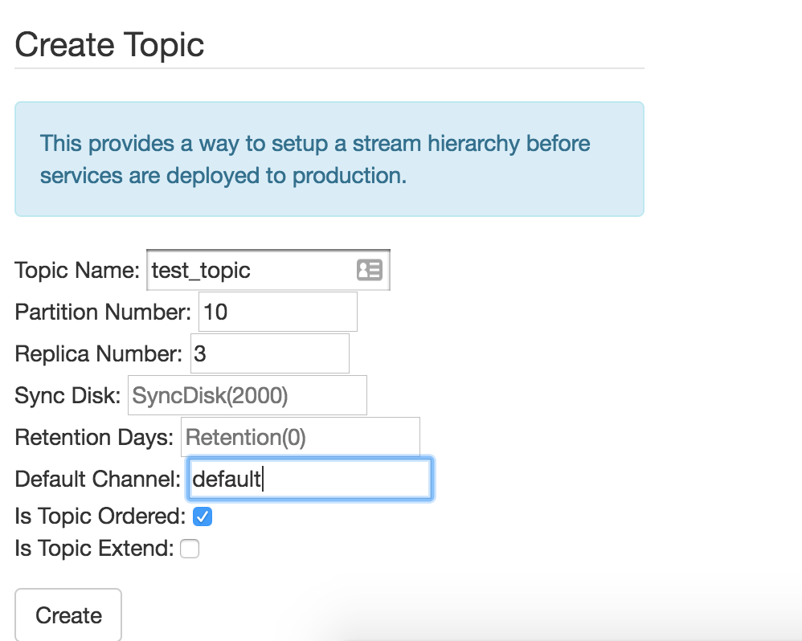

# 新版高级功能指南

## 顺序topic的使用指南
严格顺序消费需要生产方和消费方配合才能达到完全的顺序, 生产方需要指定一个顺序的字段, 比如订单id, 所有同一个订单的消息都必须单节点单线程按照顺序写入nsq, 消费业务则指定顺序消费即可, 可以多节点消费, 由服务端控制顺序推送.

### 顺序topic创建
首先在nsqadmin界面创建一个顺序topic, 具体分区数根据业务数据量决定, 对于一个每天200w消息量的topic, 建议10个分区左右



### 消息生产 (Golang, Java)
Golang示例

```Go
    topics := ["test_topic"]
    lookupAddress := "127.0.0.1:4161"
    config := nsq.NewConfig()
    // 启用顺序生产
    config.EnableOrdered = true
    // 顺序生产的分区hash算法, 针对pub传入的sharding key做hash分区, 保证同样的订单id落到同一个分区保证顺序,
    // 并且保证不同的订单id, 均匀的分散到多个分区保证不同订单id的并发能力
	config.Hasher = murmur3.New32()
	pubMgr, err := nsq.NewTopicProducerMgr(topics, config)
	if err != nil {
		log.Printf("init error : %v", err)
		return
	}
	pubMgr.SetLogger(log.New(os.Stderr, "", log.LstdFlags), nsq.LogLevelInfo)
	err = pubMgr.ConnectToNSQLookupd(lookupAddress)
	if err != nil {
		log.Printf("lookup connect error : %v", err)
		return
	}
	var id nsq.NewMessageID
	var offset uint64
	var rawSize uint32
    // 生产顺序消息, orderID就是传入需要保证顺序的订单id, 注意必须保证相同的orderID不会产生并发写入
	id, offset, rawSize, err = pubMgr.PublishOrdered(topic, orderID, msg)
```

### 消息消费

```Go
type consumeHandler struct {
	topic           string
}

func (c *consumeHandler) HandleMessage(message *nsq.Message) error {
	return nil
}

func main() {
    topic := "test_topic"
    channel := "order_sub"
    lookupAddress := "127.0.0.1:4161"
    config := nsq.NewConfig()
    // 启用顺序消费
    config.EnableOrdered = true
	config.Hasher = murmur3.New32()
	consumer, err := nsq.NewConsumer(topic, channel, config)
	if err != nil {
		panic(err.Error())
	}
    consumer.SetLogger(log.New(os.Stderr, "", log.LstdFlags), nsq.LogLevelInfo)
    // 注册并发消费处理函数
	consumer.AddConcurrentHandlers(&consumeHandler{topic}, 5)
	done := make(chan struct{})
	go func() {
        time.Sleep(time.Minute)
        // 消费完成后, 优雅停止消费
		consumer.Stop()
		<-consumer.StopChan
		close(done)
    }()
    // 连接lookup地址开始消费
    consumer.ConnectToNSQLookupd(lookupAddr)
    // 等待消费完成或者消费被停止
    <-done
}
```

## 延时消息使用指南

## 扩展消息的使用指南

### 扩展topic创建
### 扩展字段类型
### 扩展字段写入
### 消费消息的扩展字段

## 分区个数创建的建议

## 一些消费配置的建议

ready:
max_inflight:
max_attempt:
msg_timeout:
并发工作线程数:

其他值可以保持默认值

## 常见错误信息排查