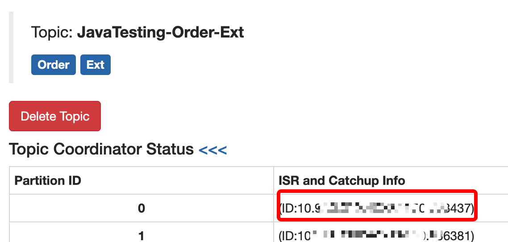

# 新版运维指南

## 源码编译步骤
- 首先确保安装了依赖管理工具: dep
- 获取源码, 使用 go get github.com/youzan/nsq , 使用git clone 务必确保代码在正确的GOPATH路径下面并且保持github.com/youzan/nsq的目录结构
- 执行 ./pre-dist.sh, 准备编译环境并安装依赖
- 执行 ./dist.sh, 编译并打包

## 简易部署配置指南
大部分参数和原版本一致, 除了几个新的集群相关的配置之外. 简单的配置步骤如下:

对nsqlookup和nsqd 使用模板配置文件并在配置文件中修改几个必要配置项
<pre>
broadcast_interface = // 监听的网卡名称
cluster_id = // 集群id, 用于区分不同集群
cluster_leadership_addresses = // etcd集群地址
rpc_port = "12345"  // 用于集群内部通信
log_dir=
data_path=
</pre>
然后分别使用 `nsqlookupd -config=/path/to/config` 启动nsqlookup, `nsqd -config=/path/to/config` 启动nsqd. (先启动nsqlookupd).
nsqdadmin使用默认配置和nsqlookupd同机部署即可.

注意etcd集群需要使用支持v2 api的版本, 目前仅支持v2 api.

## 此fork和原版的几点运维上的不同
### 关于topic的创建和删除
此版本为了内部的运维方便, 去掉了nsqd上的自动创建和删除topic的接口, 避免大量业务使用时创建的topic不在运维团队的管理范围之内, 因此把创建topic的API禁用了, 统一由运维通过nsqadmin创建需要的topic.

### 关于topic的分区限制
由于老版本没有完整的分区概念, 每台机子上面只能有一个同名的topic, 因此新版本为了兼容老版本的客户端, 对topic的partition数量做了限制, 每台机子每个topic只能有一个分区(含副本). 因此创建topic时的分区数*副本数应该不能大于集群的nsqd节点数. 对于顺序消费的topic无此限制, 因为老版本的客户端不支持顺序消费特性.

### 关于topic的初始化
由于topic本身是数据存储资源的单位, 为了避免垃圾资源, 运维限制没有初始化的topic是不能写入的. 没有初始化的topic表现为没有任何业务客户端创建channel. 因此一个没有任何channel的topic是不能写入数据的. 为了能完成初始化, 需要在nsqadmin界面创建一个默认的channel用于消费. 没有任何channel的topic如果允许写入, 会导致写入的数据没有任何人去消费, 导致磁盘一直增长.

### 关于顺序topic
顺序topic允许同一个节点存储多个分区, 创建是需要在api指定 `orderedmulti=true` 参数. 顺序topic不允许使用非顺序的方式进行消费. 因此老的官方客户端不能使用该功能

### 关于channel自动创建配置
创建topic参数支持`DisableChannelAutoCreate`配置，通过在`topic/create`api中指定`disable_channel_auto_create=true`. topic创建后，*未经过nsqlookup创建的channel将不允许在消费者建连时创建*

#### 通过nsqlookupd创建channel
nsqlookupd新增为`DisableChannelAutoCreate`属性为`true`的topic创建channel（该接口对`DisableChannelAutoCreate`属性为`true`的topic无效）

<pre>
curl POST /channel/create?topic=XXX&channel=XXX
</pre>

## 新版新增服务端配置说明
大部分配置的说明可以参考`contrib`目录下的配置示例, 使用默认值即可, 这里介绍几个值得注意的配置

```
## maximum requeuing timeout for a message
## 此参数用于控制最大的延时时间, 由于新版启用了磁盘延时消息, 因此可以支持更大时间范围的延时消息, 不过为了避免延时消息膨胀, 
## 建议配置小于48h的时间.
max_req_timeout = "24h"

## duration threshold for requeue a message to the delayed queue end
## 此参数用于控制内存延时和磁盘延时的分隔时间, 大于此值的延时消息将直接写入磁盘队列, 小于此值的会先在内存维护一个索引, 用于短时间更快的延时控制, 直到重试次数
## 超过一定值之后才会放入磁盘延时队列. 可以使用默认配置
req_to_end_threshold = "15m"
```

## 新版新增运维操作
### topic禁止某个分区节点写入
往所有的lookup节点发送如下命令
<pre>
POST /topic/tombstone?topic=xxx&node=ip:httpport
</pre>
重新允许写入 
<pre>
POST /topic/tombstone?topic=xxx&node=ip:httpport&restore=true
</pre>
此操作可以用于当某个节点磁盘不足时临时禁止写入.

### 动态调整客户端连接数限制
1.9.8之后的新版本nsqd服务端会限制客户端连接数, 初始化启动时会设置成操作系统fd限制数-5w(预留给内部使用), 超过限制后, 新建连的客户端会失败, 发生限制时, 也可以动态调整此参数, 注意先调整操作系统的最大打开文件数, 然后调整此连接数限制(注意预留一部分给内部使用)
<pre>
PUT -d '10000' /config/max_conn_for_client 
</pre>

### 动态调整topic单分区待完成pub流量限制
1.12.2之后的新版本nsqd服务端除了会限制写入排队的队列大小, 还会限制写入待发送流量, 避免读取过多待发送数据, 导致内存占用过多, 初始化可以在nsqd的配置文件配置, 可以动态调整此参数, 默认限制200MB. 注意在写入排队满的时候, 会动态减少此限制, 以避免更多的内存消耗.
<pre>
PUT -d '100000000' /config/max_pub_waiting_size
</pre>

### 动态调整服务端日志级别
<pre>
nsqd: curl -X POST "http://127.0.0.1:4151/loglevel/set?loglevel=3"
nsqlookupd: curl -X POST "http://127.0.0.1:4161/loglevel/set?loglevel=3"
</pre>
loglevel数字越大, 日志越详细

### 调整channel的消费限流值
默认每个channel都有一个限流值用于大流量消息限流(大于1KB的消息消费), 避免某个channel占用过大的网卡流量, 默认配置使用nsqd的启动配置, 一般不需要调整, 如果临时调整可以使用如下API针对性处理(注意修改后的限流仅当前有效, 重启后或者channel迁移重建后失效)
<pre>
nsqd: curl -X POST "http://127.0.0.1:4151/channel/ratelimit?topic=xx&partition=xx&channel=xx&ratekilobytes=xxx"
</pre>

### 限制channel的某个客户端连接ready值
一般来说,客户端的ready值控制着消费速度, 一般由客户端动态自由调整, 在某些异常情况下, 可以使用如下API限制某些客户端消费的最大ready值, 从而控制单个消费者的消费速度.
<pre>
nsqd: curl -X POST "http://127.0.0.1:4151/channel/setclientlimit?topic=xx&partition=xx&channel=xx&ready=xxx&client_prefix=xxx"
</pre>
所有符合条件包含client_prefix前缀的客户端都会生效限制, 仅在当前会话有效(连接重连后失效).

### 集群节点维护
以下几个API是nsqlookupd的HTTP接口, 对于修改API, 只能发送到nsqlookupd的leader节点, 可以通过listlookup
判断哪个节点是当前的leader.

主动下线某个节点, 其中nodeid是分布式的id, 可以在nsqadmin里面查看对应节点的id, 下图红框内的一串:



调用后, 系统会自动将topic数据逐步平滑迁移到其他节点, 等待完成后, 运维就可以直接关机了. 此操作用于永久从集群中下线一台机子.
<pre>
POST /cluster/node/remove?remove_node=nodeid
</pre>

### topic扩容与缩容
分区扩容API

```
/topic/partition/expand?topic=xxx&partition_num=x
```

适用于非顺序分区, 执行即可, 平滑不影响可用性. 对于顺序topic而言, 由于涉及到消息的顺序问题, 此API需要谨慎使用, 分区扩容期间的数据会出现乱序问题. 如果需要使用, 必须保证数据没有新的写入, 并且老数据全部消费完成.

非顺序分区缩容平滑缩容, 使用如下方法不影响数据读写:

首先启动一个用于迁移的临时集群, 然后使用topic平滑迁移工具, 将需要缩容的topic迁移到这个临时集群, 观察原topic的写入已经完全走到临时集群, 并且原集群没有消费积压之后, 将原集群topic删除, 创建一个分区缩容后的topic. 然后再将临时集群的topic迁移回原集群, 确认临时集群完全消费后, 删除临时集群topic, 完成缩容.

顺序分区的缩容和扩容

上述方法顺序topic可以适用, 但是可能会导致扩缩容期间可能有数据顺序的影响. 有可能出现一部分写入老的, 一部分写入新的集群, 消费时出现乱序, 不过持续时间应该很短. 一旦所有客户端都拉到新集群的lookup, 后面都是写入新集群. 建议可以部分容忍顺序的业务使用此方法. 
如果顺序要求非常严格, 则需要在流量低谷时, 临时停写, 进行topic分区重建操作, 如果业务消费延迟很低, 可以在几秒内完成, 影响较小. 因此顺序分区的规划需要考虑一个长时间的容量上限

### topic元数据调整
以下API可以用于改变topic的元数据信息, 支持修改副本数, 刷盘策略, 保留时间, 是否允许channel消费时自动创建,如果不需要改,可以不需要传对应的参数.
<pre>
POST /topic/meta/update?topic=xxx&replicator=xx&syncdisk=xx&retention=xxx&disable_channel_auto_create=xxx
</pre>

#### DisableChannelAutoCreate 元数据调整
`/meta/update`接口支持调整topic的DisableChannelAutoCreate属性：
1. disable_channel_auto_create=true 调用后，topic将 *不允许channel在消费者建连时自动创建*
2. disable_channel_auto_create=false 调用后，topic将 *允许channel在消费者建连时自动创建*

*** !!!NOTICE: 原本支持channel自动创建的topic在禁止channel自动创建生效后，原有的channel将被删除!!! ***

### 消息跟踪
服务端可以针对topic动态启用跟踪, 远程的跟踪系统是内部使用的, 因此无法提供, 不过可以使用默认的log跟踪模块. 以下跟踪打开时, 会把跟踪信息写入log文件. 以下API发送给对应的nsqd节点.
<pre>
// 启用写入跟踪
$ curl -X POST "http://127.0.0.1:4151/message/trace/enable?topic=balance_test3"
// 跟踪指定channel的消费情况
$ curl -X POST "http://127.0.0.1:4151/message/trace/enable?topic=perf_2_2_5&channel=perf_2_2_5_ch0"
// 关闭消费跟踪
$ curl -X POST "http://127.0.0.1:4151/message/trace/disable?topic=perf_2_2_5&channel=perf_2_2_5_ch0"
// 关闭写入跟踪
$ curl -X POST "http://127.0.0.1:4151/message/trace/disable?topic=balance_test3"
</pre>

### 指定消费位置
发送给对应的nsqd节点, 如果多个分区需要设置, 则对不同分区发送多次
<pre>
curl -X POST -d "xxx:xxx" "http://127.0.0.1:4151/channel/setoffset?topic=xxx&channel=xxx"
POST body:
timestamp:xxxx  (指定消费时间起点seconds, 自1970-1-1开始的秒数)
或者
virtual_queue:xxx  (指定消费队列字节位置起点, 从队列头部开始计算)
或者
msgcount:xxx (指定消费消息条数起点,从队列头部开始计算)
</pre>

### topic手动清理
此方法用于手动清理已经消费的数据, 当自动清理太慢, 导致磁盘可用不足时, 可以临时调用此API进行清理. 注意不会清理未消费的积压数据.
<pre>
curl -X POST "http://127.0.0.1:4151/topic/greedyclean?topic=xxxx&partition=xx"
</pre>

### 数据修复模式启动数据节点
当发生灾难性故障导致topic数据不可恢复时, 可以启动修复模式, 用于主动修复数据, 可能会丢弃最后写入的几秒的数据.
灾难性故障是指, 某个topic的所有副本所在机器同时瞬间宕机, 导致所有副本数据刷盘不及时.
修复模式启动成功后, 再去掉修复模式重启一遍.
修复模式修改nsqd的配置文件, 添加如下配置
<pre>
start_as_fix_mode=true
</pre>
注意: 如果只是一部分副本宕机, 不需要使用修复模式, 会自动从未宕机的副本恢复数据.

### 原始数据查看定位工具
使用nsq数据查看工具 nsq_data_tool可以定位一些数据异常, 常用用法如下:

```
# 以下命令从指定topic和分区1 使用内部消息id读取指定的消息内容
./nsq_data_tool -topic=xxx -partition=1 -data_path=/data/nsqd -view=topicdata -search_mode=id -view_start_id=1125899906873721 
  
```

参数说明:
-data_path: nsqd的根数据目录

-view:  (值=commitlog或者topicdata)查看索引日志, 还是查看topic的原始数据

-search_mode: 搜索模式有4种分别是(count | id | timestamp | virtual_offset), 分别表示根据消息条数, 消息id, 消息时间戳, 消息在队列中的偏移量来查找

-view_start: 搜索消息的起始条数, 当search mode == count时使用

-view_start_id: 搜索起始消息id, search_mode == id

-view_start_timestamp: 搜索起始消息时间戳, search_mode==timestamp

-view_offset: 搜索起始消息在队列中的偏移量, search_mode==virtual_offset

-view_cnt: 要查看从其实消息开始的多少条数据量. 默认只查看一条.

小技巧: 如何知道一个消息id应该属于哪个分区?

某个分区内的消息都是从 (id号左移50位) 的序列开始的, 所以 1分区的id前缀是 112589xxxxxxxxxx, 2号分区的前缀是225179xxxxxxxxxx

### nsqadmin监控数据说明

channel下面的统计数据说明

Depth: 最老的待确认ack的消息条数离最新的条数的间隔

DepthTimestamp:最新收到的ack确认消息时间戳

RecentDelayed: 磁盘延迟队列中下一条应该投递的消息的延迟到期时间

Memory + DiskSize: 待确认的消息在文件中的位置离最新的文件末尾位置间隔, 也就是占用磁盘大小

In-Flight: 待ack的消息条数, 包括正在处理的和内存延迟的消息

Deferred: 在内存中的延迟消息, 如果过多会移动至磁盘延迟队列

DelayedQueue: 在磁盘延迟队列中的消息条数

Requeued: 累计重试的消息条数

Timed Out: 累计超时的消息条数.

Messages: 队列中的消息总条数

### NSQ多集群多机房管理
参考技术文章:
https://mp.weixin.qq.com/s?__biz=MzAxOTY5MDMxNA==&mid=2455759899&idx=1&sn=43bbb2c0fb17b2d3e38c900ddd6b05e1&chksm=8c686a3ebb1fe328f57f1a8db46d8ca571f87c4b13f58c25f96534a15aea0b90113dca86d6bc&mpshare=1&scene=1&srcid=&rd2werd=1#wechat_redirect

## 常见故障处理

### 网络分区不可达

少于一半副本的分区会不可读写, 网络恢复后会自动重新同步数据

### 消费堆积

查看是否有客户端消费超时, 或者异常req的消息一直在重试.

### 遗留消费清理

从admin界面直接empty清理全部消息, 或者点击fin按钮手动ack某一条异常消息

### 手动清理一直重试的消息

admin界面支持点击fin按钮手动ack某一条异常消息, 需要提供内部消息ID

### 磁盘写满

下掉有问题的机子, 让副本自动迁移, 如果有单副本的topic, 需要修复模式启动

### 机器宕机

下掉有问题的机子, 让副本自动迁移